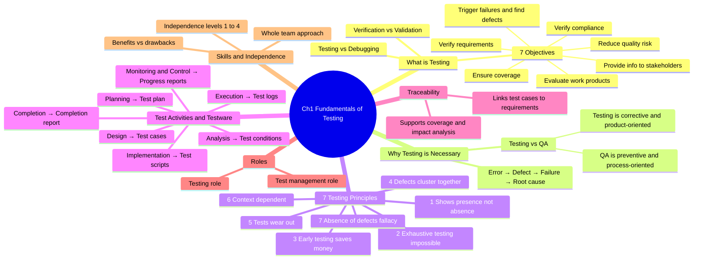

# Chapter 1 - Fundamentals of Testing Mind Map

```mermaid
mindmap
  root((Ch1 Fundamentals of Testing))
    What is Testing
      7 Objectives
        Evaluate work products
        Trigger failures and find defects
        Ensure coverage
        Reduce quality risk
        Verify requirements
        Verify compliance
        Provide info to stakeholders
      Verification vs Validation
      Testing vs Debugging
    Why Testing is Necessary
      Error → Defect → Failure → Root cause
      Testing vs QA
        Testing is corrective and product-oriented
        QA is preventive and process-oriented
    7 Testing Principles
      1 Shows presence not absence
      2 Exhaustive testing impossible
      3 Early testing saves money
      4 Defects cluster together
      5 Tests wear out
      6 Context dependent
      7 Absence of defects fallacy
    Test Activities and Testware
      Planning → Test plan
      Monitoring and Control → Progress reports
      Analysis → Test conditions
      Design → Test cases
      Implementation → Test scripts
      Execution → Test logs
      Completion → Completion report
    Traceability
      Links test cases to requirements
      Supports coverage and impact analysis
    Roles
      Test management role
      Testing role
    Skills and Independence
      Whole team approach
      Independence levels 1 to 4
      Benefits vs drawbacks
```
