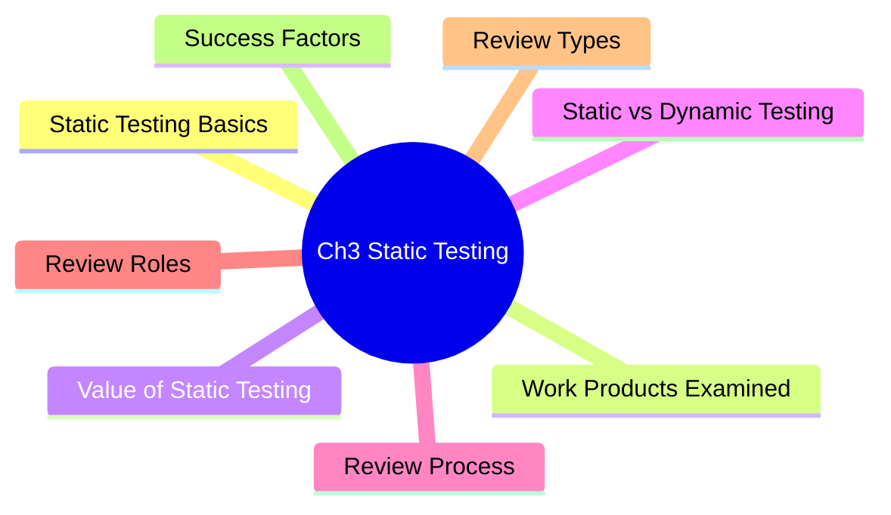

# Chapter 3 - Static Testing Mind Map

```mermaid
mindmap
  root((Ch3 Static Testing))
    Static Testing Basics
    Work Products Examined
    Value of Static Testing
    Static vs Dynamic Testing
    Review Process
    Review Roles
    Review Types
    Success Factors
```
