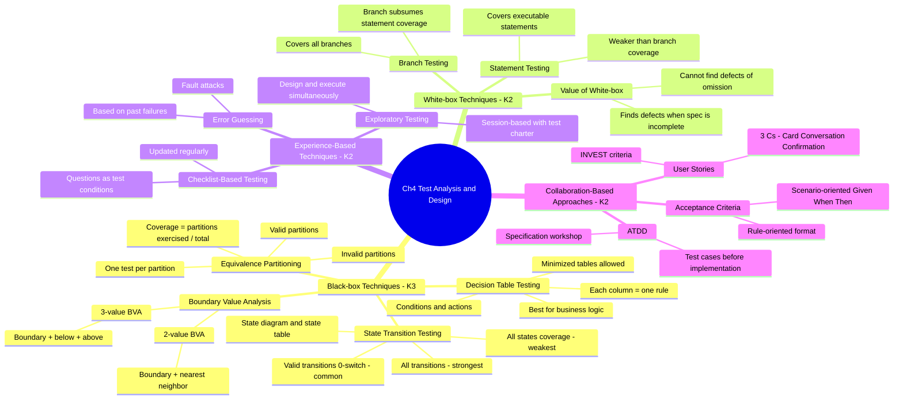

# Chapter 4 - Test Analysis and Design Mind Map

```mermaid
mindmap
  root((Ch4 Test Analysis and Design))
    Black-box Techniques - K3
      Equivalence Partitioning
        Valid partitions
        Invalid partitions
        One test per partition
        Coverage = partitions exercised / total
      Boundary Value Analysis
        2-value BVA
          Boundary + nearest neighbor
        3-value BVA
          Boundary + below + above
      Decision Table Testing
        Conditions and actions
        Each column = one rule
        Best for business logic
        Minimized tables allowed
      State Transition Testing
        State diagram and state table
        All states coverage - weakest
        Valid transitions 0-switch - common
        All transitions - strongest
    White-box Techniques - K2
      Statement Testing
        Covers executable statements
        Weaker than branch coverage
      Branch Testing
        Covers all branches
        Branch subsumes statement coverage
      Value of White-box
        Finds defects when spec is incomplete
        Cannot find defects of omission
    Experience-Based Techniques - K2
      Error Guessing
        Fault attacks
        Based on past failures
      Exploratory Testing
        Session-based with test charter
        Design and execute simultaneously
      Checklist-Based Testing
        Questions as test conditions
        Updated regularly
    Collaboration-Based Approaches - K2
      User Stories
        3 Cs - Card Conversation Confirmation
        INVEST criteria
      Acceptance Criteria
        Scenario-oriented Given When Then
        Rule-oriented format
      ATDD
        Specification workshop
        Test cases before implementation
```
