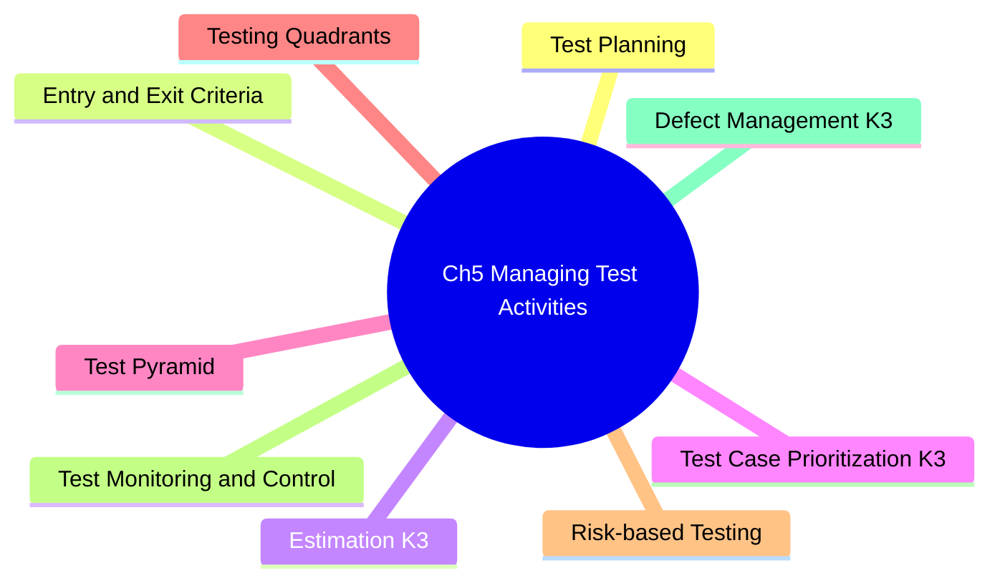

# Chapter 5 - Managing Test Activities Mind Map

```mermaid
mindmap
  root((Ch5 Managing Test Activities))
    Test Planning
    Entry and Exit Criteria
    Estimation K3
    Test Case Prioritization K3
    Test Pyramid
    Testing Quadrants
    Risk-based Testing
    Test Monitoring and Control
    Defect Management K3
```
